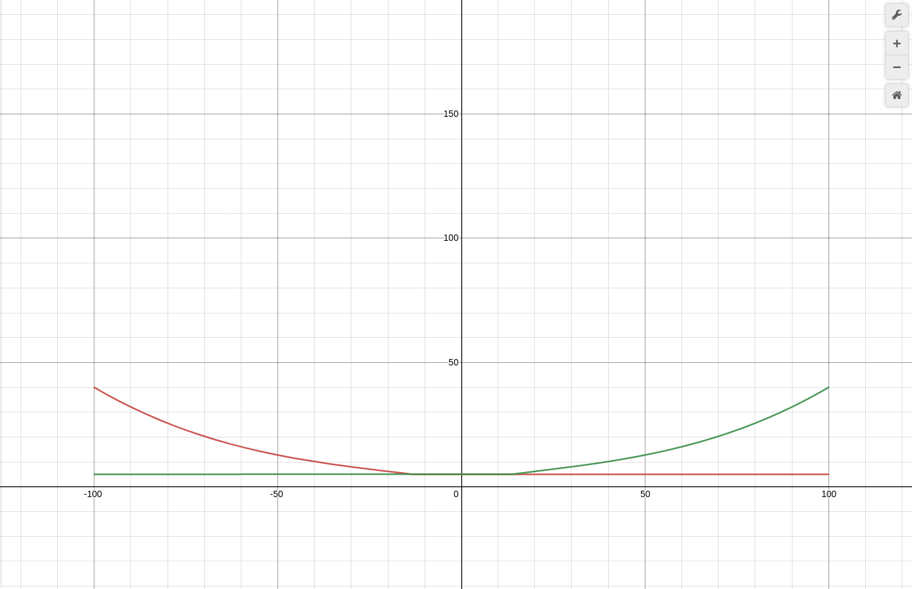

# ZigZag Market making bot for rETH/ETH

Market making bot using on-chain rETH ratio to provide liquidity on ZkSync L2 thanks to ZigZag Exchange.

## Install

`docker build . -t zigzag-mm-reth`


## Run

 ```bash
 docker run -d \
--name=zigzag-mm-reth \
-e PRIVATE_KEY=0123456789 \
-e ETH_RPC=http://localhost:8545 \
-e MIN_SPREAD_BP=5 \
-e MAX_SPREAD_BP=40 \
-e LOG_LEVEL=2 \
--restart unless-stopped \
zigzag-mm-reth
 ```

## Configuration

- ZIGZAG_WS: ZiZag websocket(default: wss://zigzag-exchange.herokuapp.com)
- ETH_RPC: Ethereum node RPC used for rETH ratio(default: http://localhost:8545)
- NETWORK: Network used(name) 1 = mainnet(default: mainnet)
- CHAIN_ID: Chain used(number) (default: 1)
- PRIVATE_KEY: Your private key used for the MM bot
- CLIENT_ID: Random client ID for zigzag liquidity(default: random)
- MARKET_ID: Market id on ZigZag(string)(default: rETH-ETH)
- MIN_SPREAD_BP: How much Basis point the bot will ask at least(1bp = 0.01%)(default: 5)
- MAX_SPREAD_BP: How much Basis point the bot will ask at most(1bp = 0.01%)(default: 40)
- EXPONENT: Used to define the curve of spread based on inventory imbalance(MUST BE ODD NUMBER !!!)(default: 3)
- RANGE_FOCUS: Used to define the curve of spread based on inventory imbalance(default: 0.5)
- SLICE: How much slice will be used to indicate liquidity to ZigZag(default: 100)
- RETH_ID: Id Asset A (number)(default: 132)
- ETH_ID: Id Asset B (number)(default: 0)
- LOG_LEVEL: Log level, trace=0, debug=1, info=2, warn=4, error=5, silent=6(default: 0)

## Fine-tuning

You can fine-tune your spread setting with this graph:
https://www.desmos.com/calculator/2tvnxkbsqi


Increase the exponent will make the curve more exponential and decrease the range focus will flatten the curve.